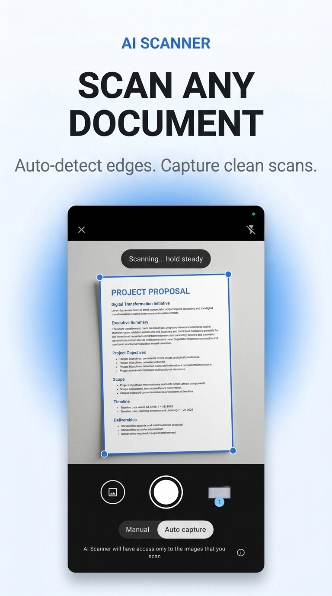
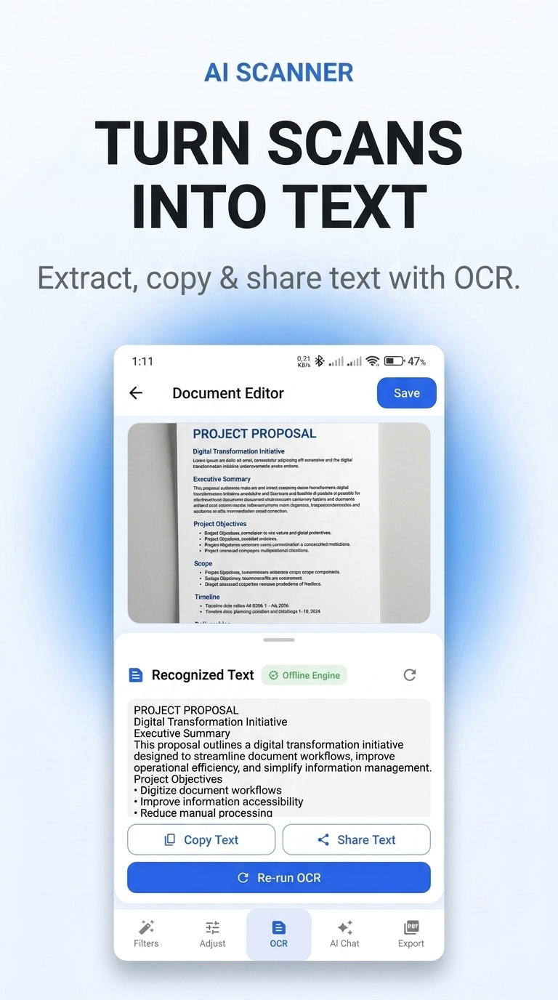
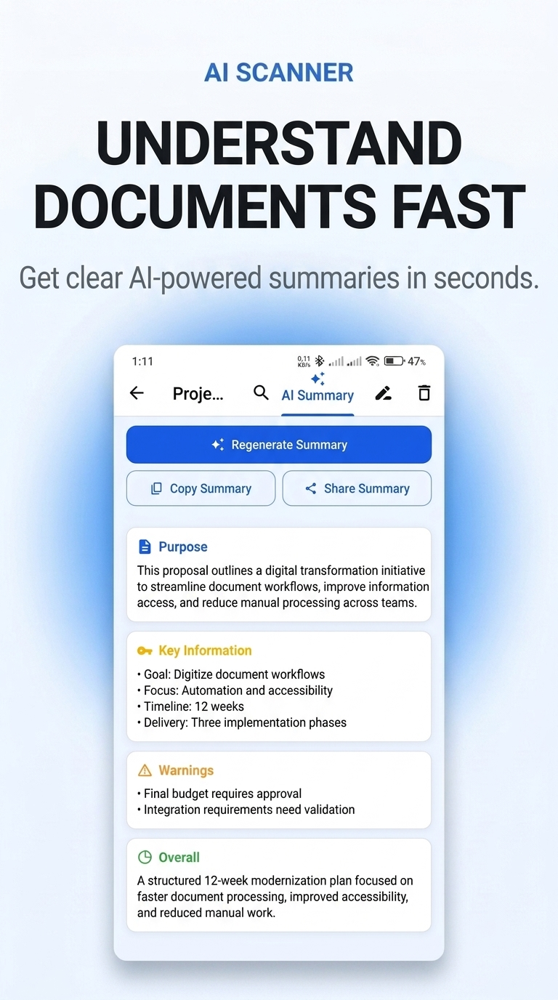
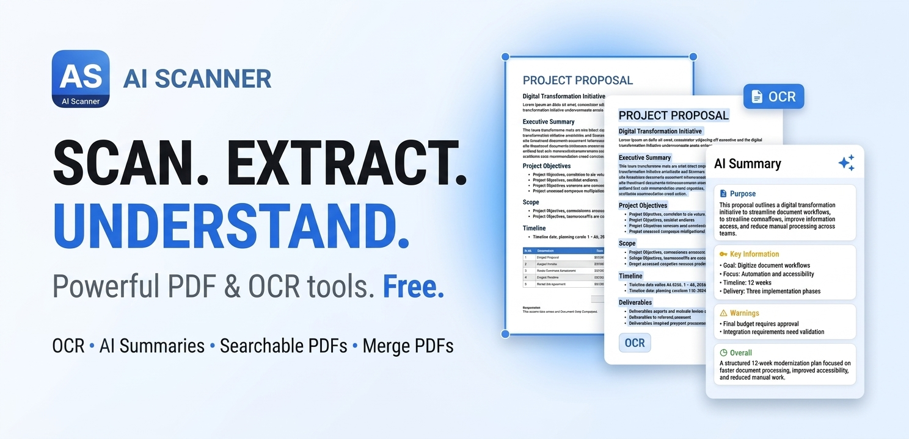

# AI Scanner – PDF, OCR & AI Document Intelligence

**AI Scanner** is an Android document productivity application engineered to turn physical paper, receipts, contracts, and notes into structured, searchable, and intelligent digital documents.

Combining fast on-device computer vision and optical character recognition (OCR) with optional cloud-based Gemini AI capabilities, AI Scanner provides a privacy-first workflow that processes documents locally on your device while offering context-aware AI document insights when needed.

---

## 🚀 Live Product Website

- **Official Landing Page**: [https://kripa123456789.github.io/ai-scanner/](https://kripa123456789.github.io/ai-scanner/)
- **Privacy Policy**: [https://kripa123456789.github.io/ai-scanner/privacy.html](https://kripa123456789.github.io/ai-scanner/privacy.html)
- **Terms of Service**: [https://kripa123456789.github.io/ai-scanner/terms.html](https://kripa123456789.github.io/ai-scanner/terms.html)

---

## 📱 About AI Scanner

Traditional document scanning applications focus primarily on basic image capture and simple PDF creation. While digitizing physical paper into flat images is useful, flat documents remain static, non-searchable, and difficult to organize or analyze efficiently.

**AI Scanner** reimagines the document workflow. It bridges physical media and digital intelligence by combining automated edge detection, image enhancement, on-device text extraction, PDF compilation, and optional generative AI capabilities. Users can instantly search inside extracted text, merge multi-page documents, and generate key summaries or action items directly from scanned content.

```
Physical / Scanned Document
          ↓
  [ Document Capture ]
          ↓
  [ Image Processing ] ──► Auto-Crop & Filter (On-Device)
          ↓
   [ On-Device OCR ]  ──► Text Extraction (On-Device)
          ↓
[ Searchable PDF / Tools ] ──► Library, Export & PDF Merge
          ↓
[ Optional Gemini AI ] ──► Document Summaries & Insights
```

---

## ✨ Key Features

- **Smart Document Capture**: Automatic document boundary detection, perspective correction, auto-cropping, and adaptive image enhancement filters (Color, Grayscale, B&W).
- **On-Device OCR Engine**: High-accuracy optical character recognition executing locally on-device. Converts scanned images into selectable, copyable, and searchable text without network dependence.
- **Searchable PDF Generation**: Compiles multi-page scans into clean, industry-standard searchable PDFs containing embedded text layers.
- **PDF Tools & Organization**: Full document workspace supporting page reordering, page insertion, PDF splitting, and multi-document merging.
- **Gemini-Powered Document Intelligence**: Optional AI assistant that analyzes extracted text to generate structured summaries, identify key dates/parties, highlight warnings, and answer document queries.
- **Local-First Architecture**: Core scanning, image enhancement, and OCR operations remain entirely on-device for maximum speed, offline availability, and privacy.

---

## 🧠 How It Works

AI Scanner follows a decoupled, pipeline architecture that strictly isolates local document operations from optional cloud AI capabilities:

```
┌─────────────────────────────────────────────────────────────┐
│                    LOCAL DEVICE BOUNDARY                    │
│                                                             │
│   ┌──────────────┐     ┌────────────────┐     ┌─────────┐   │
│   │ Camera / File│ ──► │ Image Filtering│ ──► │ On-Device│  │
│   │    Import    │     │   & Auto-Crop  │     │   OCR   │   │
│   └──────────────┘     └────────────────┘     └────┬────┘   │
│                                                    │        │
│   ┌──────────────┐     ┌────────────────┐          │        │
│   │  Searchable  │ ◄── │ Document Library│ ◄────────┘        │
│   │  PDF Export  │     │    & Tools     │                   │
│   └──────────────┘     └───────┬────────┘                   │
└────────────────────────────────┼────────────────────────────┘
                                 │ (Optional User Request)
                                 ▼
┌─────────────────────────────────────────────────────────────┐
│                 EXTERNAL AI INTELLIGENCE                    │
│                                                             │
│                     ┌──────────────────┐                    │
│                     │  Gemini AI API   │                    │
│                     │ Document Insight │                    │
│                     └──────────────────┘                    │
└─────────────────────────────────────────────────────────────┘
```

1. **Capture & Enhancement**: The camera engine captures the physical document and applies thresholding and perspective transformation locally.
2. **Local Text Extraction**: The on-device OCR engine processes image frames to build an indexable text map without transmitting images over the network.
3. **Document Compilation**: Extracted text and enhanced images are bound into searchable PDFs or managed inside the local document library.
4. **Optional AI Analysis**: If the user requests an AI summary or analysis, the extracted text payload is transmitted to the Gemini API endpoint to produce structured insights.

---

## 🔒 Privacy-First Architecture

Privacy is built directly into the software design of AI Scanner:

- **Local-First Processing**: Document scanning, image processing, boundary cropping, and OCR text extraction execute 100% locally on the user's Android device.
- **Isolated Cloud AI**: Extracted text is sent to Google's Gemini AI service **only** when the user explicitly triggers an AI summary or document query action.
- **No Unsolicited Background Uploads**: Documents, scans, and original images are never automatically synced or uploaded to external servers in the background.

For full privacy disclosures, review our official [Privacy Policy](https://kripa123456789.github.io/ai-scanner/privacy.html).

---

## 🛠 Technology & Product Architecture

### Android Application Architecture
- **Core Platform**: Flutter & Dart (Clean Architecture with BLoC state management)
- **Computer Vision**: On-device image processing algorithms for contour detection, perspective correction, and thresholding
- **On-Device Engine**: Local ML Kit / OCR engine for fast text recognition
- **AI Integration**: Google Gemini API for natural language document synthesis and structured summaries
- **Storage & Export**: Local encrypted database & PDF engine for document compilation

### Public Product Website
- **Frontend Stack**: Vanilla HTML5, CSS3, JavaScript (Lightweight, zero-framework static implementation)
- **Hosting & Deployment**: GitHub Pages (`.nojekyll` configuration)
- **SEO & Metadata**: GitHub-compatible relative path routing, Schema.org `SoftwareApplication` JSON-LD structured data, Open Graph tags, and Twitter Cards

---

## 🖼 Product Preview

| Scanner Interface | OCR Text Extraction | AI Document Summary |
| :---: | :---: | :---: |
|  |  |  |

| Searchable PDF & Marketing Banner |
| :---: |
|  |

---

## 🌐 Public Repository Notice

This public repository contains the **official product landing page, web assets, and public documentation** for AI Scanner.

The core Android application source code, proprietary computer vision filters, and Flutter codebase are maintained in a private repository to protect intellectual property and application security.

---

## 📱 Android Release Status

AI Scanner is currently in final testing and optimization for its upcoming Android release on Google Play.

Visit the [Live Product Website](https://kripa123456789.github.io/ai-scanner/) for feature previews, technical specifications, and release updates.

---

## 🔗 Official Links

- **Product Website**: [https://kripa123456789.github.io/ai-scanner/](https://kripa123456789.github.io/ai-scanner/)
- **Privacy Policy**: [https://kripa123456789.github.io/ai-scanner/privacy.html](https://kripa123456789.github.io/ai-scanner/privacy.html)
- **Terms of Service**: [https://kripa123456789.github.io/ai-scanner/terms.html](https://kripa123456789.github.io/ai-scanner/terms.html)
- **GitHub Repository**: [https://github.com/kripa123456789/ai-scanner](https://github.com/kripa123456789/ai-scanner)

---

*© 2026 AI Scanner. All rights reserved.*
